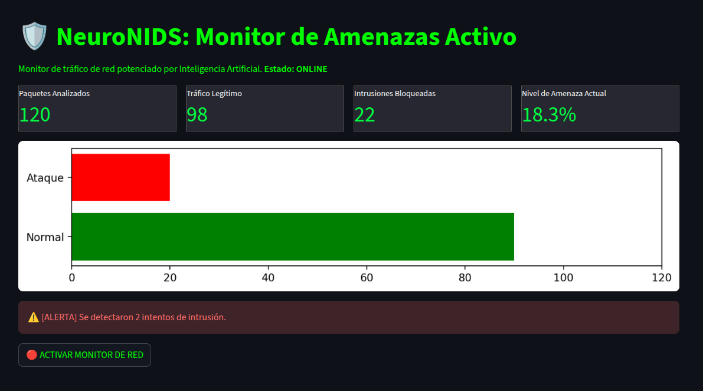

# 🛡️ NeuroNIDS: Sistema de Detección de Intrusos con IA


> *MVP (Producto Mínimo Viable).*

---

## 📋 Descripción del Proyecto

**NeuroNIDS** es un sistema de ciberseguridad diseñado para Pequeñas y Medianas Empresas (PyMEs). A diferencia de los firewalls tradicionales basados en hardware costoso, NeuroNIDS utiliza **Inteligencia Artificial (Machine Learning)** alojada en la nube para analizar tráfico de red y detectar anomalías o intrusiones en tiempo real.

Este proyecto busca democratizar el acceso a la seguridad informática avanzada, ofreciendo una solución **SaaS (Software as a Service)** escalable, económica y fácil de gestionar.

### 🚀 Demo en Vivo
Puedes acceder al tablero de control operativo en el siguiente enlace:
👉 **[VER DASHBOARD ONLINE](https://neuronids-project-9k9wamizvtslymrwewp5uf.streamlit.app/)**

---

### El Dashboard de Detección
Una vez entrenado el modelo de Inteligencia Artificial (Random Forest) y desplegada la aplicación en Streamlit Cloud, se obtuvo una interfaz de monitoreo operativa accesible vía web. El dashboard procesa el flujo de datos simulado en tiempo real, clasificando cada conexión como "Legítima" o "Ataque", y presentando KPIs críticos (Nivel de Amenaza, Paquetes Bloqueados) para la toma de decisiones inmediata ante incidentes de seguridad.


---

## 🧠 Arquitectura Técnica

El sistema se basa en un modelo de **Machine Learning Supervisado** entrenado para clasificar conexiones de red como "Normales" o "Ataques".

*   **Algoritmo:** Random Forest Classifier.
*   **Dataset de Entrenamiento:** NSL-KDD (Estándar académico para IDS).
*   **Precisión del Modelo:** >98% en pruebas de validación.
*   **Infraestructura:** Cloud Computing (Streamlit Cloud).

### Stack Tecnológico
*   **Lenguaje:** Python 3.10
*   **Interfaz (Frontend):** Streamlit
*   **Procesamiento de Datos:** Pandas & NumPy
*   **Inteligencia Artificial:** Scikit-Learn
*   **Serialización:** Joblib

### Arquitectura Cloud
Para este proyecto se optó por un stack tecnológico de alto rendimiento y costo cero:
- **Cloud Computing:** Despliegue en Streamlit Cloud utilizando entornos virtualizados de Python 3.10.
- **Gestión de Dependencias:** Implementación de `Pipfile` para asegurar la reproducibilidad del entorno (Pipenv).
- **Inteligencia Artificial:** Modelo Random Forest persistido con `joblib`, optimizado para análisis de patrones de tráfico.
- **Visualización:** Gráficos dinámicos con `Matplotlib` integrados en una interfaz reactiva.

---

## 📊 Funcionalidades Clave

1.  **Monitoreo en Tiempo Real:** Simulación de captura de paquetes de red y análisis instantáneo.
2.  **Detección de Amenazas:** Identificación de patrones de ataque (DoS, Probe, R2L, U2R).
3.  **Dashboard de Gestión:** Visualización de KPIs (Indicadores Clave de Desempeño) para la toma de decisiones rápidas.
4.  **Sistema de Alertas:** Notificaciones visuales ante la detección de tráfico malicioso.

---

## 💼 Visión de Negocio: Fortia Security

Este desarrollo sirve como base tecnológica para **Fortia Security**, una propuesta de empresa de servicios de Ciberdefensa orientada al mercado B2B.

**Modelo de Servicio Propuesto:**
*   **Auditoría Automatizada:** Despliegue del agente en la red del cliente para diagnósticos de seguridad.
*   **Monitoreo Continuo:** Suscripción mensual para vigilancia 24/7 mediante el Dashboard en la nube.
*   **Reducción de Costos:** Eliminación de CAPEX (Gasto de Capital en Hardware) reemplazándolo por OPEX (Gasto Operativo en Servicios).

---

## 🛠️ Instalación Local (Para Desarrolladores)

Si deseas correr este proyecto en tu propia máquina:

1.  **Clonar el repositorio:**
    ```bash
    git clone https://github.com/Martincho83/NeuroNIDS-Project.git
    cd NeuroNIDS-Project
    ```

2.  **Instalar dependencias:**
    ```bash
    pip install pipenv
    pipenv install
    ```
    *(O instalar manualmente: `pip install streamlit pandas scikit-learn joblib matplotlib seaborn`)*

3.  **Ejecutar la aplicación:**
    ```bash
    streamlit run app.py
    ```

---

## 👨‍💻 Autor
[Martincho83](https://github.com/Martincho83)

---
*Este proyecto es de código abierto bajo la licencia MIT.*
